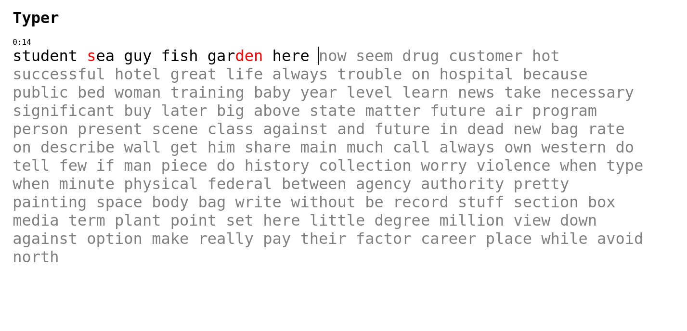

# Typer

## What is this?

A simple test typing game, where you're given a block of text and you try to
write it as fast as possible. Similar to The Typing Cat and Monkeytype.

Useful for learning touch typing to type faster and for trying out your new keyboard.

## Screenshots




## Trying it out 

### Online 

The game is hosted with GitHub pages, try it out at https://bnuredini.github.io/typer.

### Running locally

Run the small Go server using 

```
cd backend
go build 
./typer
```

then go to http://localhost:8080.

## License

See the [license file](./LICENSE).
